# Deploy VMware Tanzu for Kubernetes Operations on VMware vSphere with VMware NSX-T

This document provides step-by-step instructions for deploying Tanzu Kubernetes Operations in an Internet available vSphere environment backed by NSX-T Data Center networking.

The scope of the document is limited to providing deployment steps based on the reference design in [VMware Tanzu for Kubernetes Operations on vSphere with NSX-T](../reference-designs/tko-on-vsphere-nsx.md). It does not cover deployment procedures for the underlying SDDC components.

## Deploying with VMware Service Installer for Tanzu

You can use VMware Service Installer for VMware Tanzu to automate this deployment.

VMware Service Installer for Tanzu automates the deployment of the reference designs for Tanzu for Kubernetes Operations. It uses best practices for deploying and configuring the required Tanzu for Kubernetes Operations components.

To use Service Installer to automate this deployment, see [Deploying VMware Tanzu for Kubernetes Operations on vSphere with NSX-T Using Service Installer for VMware Tanzu](https://docs.vmware.com/en/Service-Installer-for-VMware-Tanzu/2.1/service-installer/GUID-index.html).

Alternatively, if you decide to manually deploy each component, follow the steps provided in this document.

## Supported Component Matrix

The validated Bill of Materials that can be used to install Tanzu Kubernetes Grid on your vSphere with NSX environment is as follows:

|**Software Components**|**Version**|
| --- | --- |
|Tanzu Kubernetes Grid|2.1.x|
|VMware vSphere ESXi|7.0 U3d and later|
|VMware vCenter (VCSA)|7.0 U3d and later |
|NSX Advanced Load Balancer|22.1.2|
|VMware NSX-T|3.2.1.2|

For up-to-date information about which software versions can be used together, see the [Interoperability Matrix](https://interopmatrix.vmware.com/Interoperability?col=551,9293&row=789,%262,%26912).

## Prepare Environment for Deploying Tanzu for Kubernetes Operations

Before deploying Tanzu for Kubernetes Operations on vSphere, ensure that your environment is set up as described in the following requirements:

- [General Requirements](#genreq)
- [Network Requirements](#netreq)
- [Firewall Requirements](#fwreq)

### <a id="genreq"> </a> General Requirements

- A vCenter with NSX-T backed environment.
- Ensure that following NSX-T configurations are in place:

  **Note:** The following provides only a high-level overview of the required NSX-T configuration. For more information, see [NSX-T Data Center Installation Guide](https://docs.vmware.com/en/VMware-NSX-T-Data-Center/3.2/installation/GUID-3E0C4CEC-D593-4395-84C4-150CD6285963.html) and [NSX-T Data Center Product Documentation](https://docs.vmware.com/en/VMware-NSX/index.html).

  - NSX-T manager instance is deployed and configured with Advanced or higher license.
  - vCenter Server that is associated with the NSX-T Data Center is configured as Compute Manager.
  - Required overlay and vLAN Transport Zones are created.
  - IP pools for host and edge tunnel endpoints (TEP) are created.
  - Host and edge uplink profiles are in place.
  - Transport node profiles are created. This is not required if configuring NSX-T data center on each host instead of the cluster.
  - NSX-T data center configured on all hosts part of the vSphere cluster or clusters.
  - Edge transport nodes and at least one edge cluster is created
  - Tier-0 uplink segments and tier-0 gateway is created.
  - Tier-0 router is peered with uplink L3 switch.
  - DHCP profile is created in NSX.
- SDDC environment has the following objects in place:
  - A vSphere cluster with at least three hosts on which vSphere DRS is enabled and NSX-T is successfully configured.
  - A dedicated resource pool to deploy the following Tanzu Kubernetes management cluster, shared services cluster, and workload clusters. The number of required resource pools depends on the number of workload clusters to be deployed.
  - VM folders to collect the Tanzu Kubernetes Grid VMs.
  - A datastore with sufficient capacity for the control plane and worker node VM files.
  - Network time protocol (NTP) service is running on all hosts and vCenter.
  - A host, server, or VM based on Linux, macOS, or Windows which acts as your bootstrap machine which has docker installed. For this deployment, a virtual machine based on Photon OS will be used.
  - Depending on the OS flavor of the bootstrap VM, download and configure the following packages from [VMware Customer Connect](https://customerconnect.vmware.com/downloads/info/slug/infrastructure_operations_management/vmware_tanzu_kubernetes_grid/2_x). To configure required packages on the Cent OS machine, see [Deploy and Configure Bootstrap Machine](#configurebootstrap)."
    - Tanzu CLI 2.1.0
    - Kubectl cluster CLI 1.24.9
  - A vSphere account with permissions as described in [Required Permissions for the vSphere Account](https://docs.vmware.com/en/VMware-Tanzu-Kubernetes-Grid/2.1/tkg-deploy-mc-21/mgmt-reqs-prep-vsphere.html).
  - Download and import NSX Advanced Load Balancer 22.1.2 OVA to Content Library.
  - Download the following OVA files from [VMware Customer Connect](https://customerconnect.vmware.com/downloads/info/slug/infrastructure_operations_management/vmware_tanzu_kubernetes_grid/2_x) and import to vCenter. Convert the imported VMs to templates."
    - Photon v3 Kubernetes v1.24.9 OVA and/or
    - Ubuntu 2004 Kubernetes v1.24.9 OVA  

**Note**: You can also download supported older versions of Kubernetes from [VMware Customer Connect](https://customerconnect.vmware.com/en/downloads/details?downloadGroup=TKG-160&productId=988&rPId=93384) and import them to deploy workload clusters on the intended Kubernetes versions."

**Resource Pools and VM Folders:**

The sample entries of the resource pools and folders that need to be created are as follows.

|**Resource Type**|**Sample Resource Pool Name**|**Sample Folder Name**|
| --- | --- | --- |
|NSX ALB Components|`tkg-vsphere-alb-components`|`tkg-vsphere-alb-components`|
|TKG Management components|`tkg-management-components`|`tkg-management-components`|
|TKG Shared Service Components|`tkg-vsphere-shared-services`|`tkg-vsphere-shared-services`|
|TKG Workload components|`tkg-vsphere-workload`|`tkg-vsphere-workload`|

### <a id="netreq"> </a> Network Requirements

Create separate logical segments in NSX-T for deploying TKO components as per [Network Requirements](../reference-designs/tko-on-vsphere-nsx.md#a-idnetreq-a-network-requirements) defined in the reference architecture.

### <a id="fwreq"> </a>  Firewall Requirements

Ensure that the firewall is set up as described in [Firewall Requirements](../reference-designs/tko-on-vsphere-nsx.md#a-idfwreq-a-firewall-requirements).

### <a id="cidrex"> </a>  Subnet and CIDR Example

For this demonstration, this document makes use of the following subnet CIDR for Tanzu for Kubernetes Operations deployment.

|**Network Type**|**Segment Name**|**Gateway CIDR**|**DHCP Pool in NSXT**|**NSX ALB IP Pool**|
| --- | --- | --- | --- | --- |
|NSX ALB Management Network|sfo01-w01-vds01-albmanagement|172.16.170.1/24|N/A|172.19.170.24 - 172.19.170.200|
|TKG Cluster VIP Network|sfo01-w01-vds01-tkgclustervip|172.16.180.1/24|N/A|172.16.180.8 - 172.16.180.200|
|TKG Management Network|sfo01-w01-vds01-tkgmanagement|172.16.140.1/24|172.16.140.8 - 172.16.140.200|N/A|
|TKG Shared Service Network|sfo01-w01-vds01-tkgshared|172.16.150.1/27|172.16.150.8 - 172.16.150.200|N/A|
|TKG Workload Network|sfo01-w01-vds01-tkgworkload|172.16.160.1/24|172.16.160.8- 172.16.160.200|N/A|

## Deployment Overview

The steps for deploying Tanzu for Kubernetes Operations on vSphere backed by NSX-T are as follows:

1. [Configure T1 Gateway and Logical Segments in NSX-T Data Center](#configurensxt)
2. [Deploy and Configure NSX Advanced Load Balancer](#deploynsxalb)
3. [Deploy and Configure Bootstrap Machine](#configurebootstrap)
4. [Deploy Tanzu Kubernetes Grid Management Cluster](#deploy-mgmt-cluster)
5. [Register Tanzu Kubernetes Grid Management Cluster with Tanzu Mission Control](#tmc-integration)
6. [Deploy Tanzu Kubernetes Grid Shared Service Cluster](#createsharedsvc)
7. [Deploy Tanzu Kubernetes Grid Workload Cluster](#createworkload)
8. [Integrate Tanzu Kubernetes Clusters with Tanzu Observability](#integrate-to)
9. [Integrate Tanzu Kubernetes Clusters with Tanzu Service Mesh](#integrate-tsm)
10. [Deploy User-Managed Packages on Tanzu Kubernetes Grid Clusters](#packages)

## <a id="configurensxt"> </a> Configure T1 Gateway and Logical Segments in NSX-T Data Center

As a prerequisite, an NSX-T backed vSphere environment must be configured with at least one tier-0 gateway. A tier-0 gateway performs the functions of a tier-0 logical router. It processes traffic between the logical and physical networks. For more information on creating and configuring a tier-0 gateway, see [NSX-T documentation](https://docs.vmware.com/en/VMware-NSX-T-Data-Center/3.2/administration/GUID-E9E62E02-C226-457D-B3A6-FE71E45628F7.html).

This procedure comprises the following tasks:

1. Add a Tier-1 Gateway
1. Create Overlay-Backed Segments

### Add a Tier-1 Gateway

The tier-1 logical router must be connected to the tier-0 logical router to get the northbound physical router access. The following procedure provides the minimum required configuration to create a tier-1 gateway, which is adequate to successfully deploy the Tanzu for Kubernetes Operations stack. For a more advanced configuration, see [NSX-T documentation](https://docs.vmware.com/en/VMware-NSX/index.html).

1. With admin privileges, log in to NSX Manager.
1. Select **Networking** > **Tier-1 Gateways**.
1. Click **Add Tier-1 Gateway**.
1. Enter a name for the gateway.
1. Select a tier-0 gateway to connect to this tier-1 gateway to create a multi-tier topology.
1. Select an NSX Edge cluster. This is required for this tier-1 gateway to host stateful services such as NAT, load balancer, or firewall.
1. (Optional) In the **Edges** field, select **Auto Allocated** or manually set the edge nodes.
1. Select a failover mode or accept the default. The default option is Non-preemptive.
1. Select **Enable Standby Relocation**.
1. Click **Route Advertisement** and ensure that following routes are selected:
   * **All DNS Forwarder Routes**
   * **All Connected Segments and Service Ports**
   * **All IPSec Local Endpoints**
   * **All LB VIP Routes**
   * **All LB SNAT IP Routes**

    

1. Click **Save**.
    
#### DHCP configuration on Tier-1 Gateway

Complete the following steps to set the DHCP configuration in the tier-1 gateway:

1. With admin privileges, log in to NSX Manager.
1. Select **Networking** > **Tier-1 Gateways**.
1. On the tier-1 gateway that you created earlier, click the three dots menu and select **Edit**.
1. Next to DHCP Config, click **Set**.


1. In the Set DHCP Configuration dialog box, set **Type** to DHCP Server and select the DHCP profile that you created as part of the prerequisites.

   

1. Click **Save**.

### Create Overlay-Backed Segments

VMware NSX provides the option to add two kinds of segments: overlay-backed segments and VLAN-backed segments. Segments are created as part of a transport zone. There are two types of transport zones: VLAN transport zones and overlay transport zones. A segment created in a VLAN transport zone is a VLAN-backed segment and a segment created in an overlay transport zone is an overlay-backed segment.

Create the overlay backed logical segments as shown in the [Overlay backed segments CIDR example](#cidrex). All these segments will be a part of the same overlay transport zone and they must be connected to the tier-1 gateway.

The following procedure provides required details to create one such network which is required for the Tanzu for Kubernetes Operations deployment:

1. With admin privileges, log in to NSX Manager

1. Select **Networking** > **Segments**.

1. Click **ADD SEGMENT** and enter a name for the segment. For example, `sfo01-w01-vds01-tkgmanagement`

1. Under **Connected Gateway**, select the tier-1 gateway that you created earlier.

1. Under **Transport Zone**, select a transport zone that will be an overlay transport zone.

1. Under **Subnets**, enter the gateway IP address of the subnet in the CIDR format. For example, `172.16.140.1/24`

   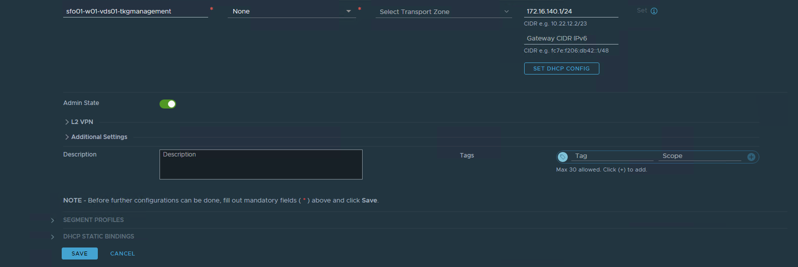

    **Note:** The following  step is required only for Tanzu Kubernetes Grid management network, shared services network, and workload network.

1. Click **SET DHCP CONFIG**.

    **DHCP Type** field is set to Gateway DHCP Server and **DHCP Profile** is set to the profile created while creating the tier-1 gateway.

   1. Click **Settings**, select **Enable DHCP Config**, and enter the DHCP range and DNS server information.

      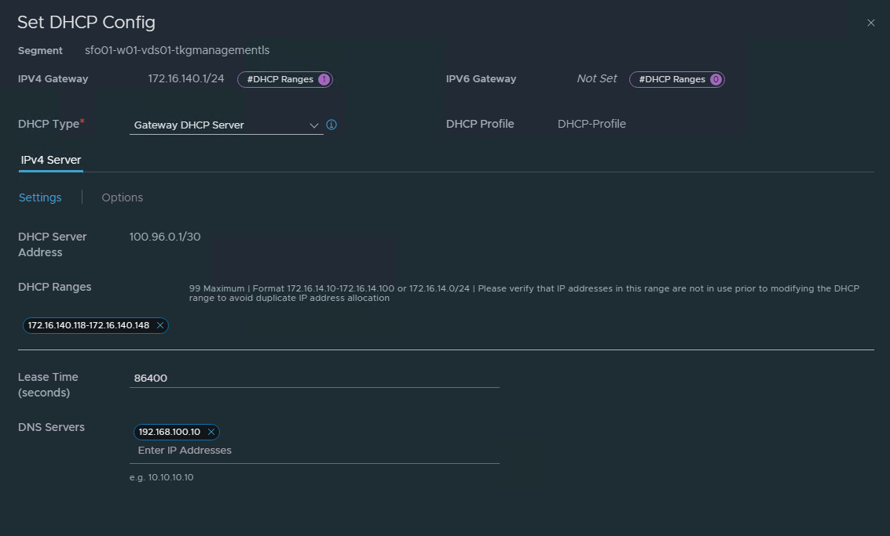

   1. Click **Options** and under **Select DHCP Options**, select **GENERIC OPTIONS**.

   1. Click **ADD GENERIC OPTION**, Add **NTP servers (42)** and **Domain Search (119)**.

      

   1. Click **Save** to create the logical segment.

Repeat steps 1-7 to create all other required overlay-backed segments. Once completed, you should see an output similar to:

   

Additionally, you can create the required inventory groups and firewall rules. For more information, see [NSX-T Data Center Product Documentation](https://docs.vmware.com/en/VMware-NSX/index.html).

## <a id="deploynsxalb"> </a>   Deploy and Configure NSX Advanced Load Balancer

NSX Advanced Load Balancer (ALB) is an enterprise-grade integrated load balancer that provides L4- L7 load balancer support. It is recommended for vSphere deployments without NSX-T or when there are unique scaling requirements.

NSX Advanced Load Balancer is deployed in Write Access Mode in the vSphere Environment backed by NSX-T. This mode grants NSX Advanced Load Balancer controllers full write access to the vCenter or NSX which helps in automatically creating, modifying, and removing service engines (SEs) and other resources as needed to adapt to changing traffic needs.

For a production-grade deployment, it is recommended to deploy 3 instances of the NSX Advanced Load Balancer controller for high availability and resiliency.

The sample IP address and FQDN set for the NSX Advanced Load Balancer controllers is as follows:

|**Controller Node**|**IP Address**|**FQDN**|
| --- | --- | --- |
|Node 1 Primary|172.16.170.18|`sfo01albctlr01a.sfo01.rainpole.local`|
|Node 2 Secondary|172.16.170.19|`sfo01albctlr01b.sfo01.rainpole.local`|
|Node 3 Secondary |172.16.170.20|`sfo01albctlr01c.sfo01.rainpole.local`|
|HA Address|172.16.170.17|`sfo01albctlr01.sfo01.rainpole.local`|

### <a id="deploynsxalb"> </a> Deploy NSX Advanced Load Balancer

As part of the prerequisites, you must have the NSX Advanced Load Balancer 22.1.2 OVA downloaded and imported to the content library. Deploy the NSX Advanced Load Balancer under the resource pool **tkg-vsphere-alb-components**  and place it under the folder **tkg-vsphere-alb-components**.

To deploy NSX Advanced Load Balancer, complete the following steps.

1. Log in to **vCenter** and navigate to **Home** > **Content Libraries**.
1. Select the content library under which the NSX-ALB OVA is placed.
1. Click on **OVA & OVF Templates**.
1. Right-click the NSX Advanced Load Balancer image and select **New VM from this Template**.
1. On the Select name and folder page, enter a name and select a folder for the NSX Advanced Load Balancer VM as **tkg-vsphere-alb-components**.
1. On the Select a compute resource page, select the resource pool **tkg-vsphere-alb-components**.
1. On the Review details page, verify the template details and click **Next**.
1. On the Select storage page, select a storage policy from the VM Storage Policy drop-down menu and choose the  datastore location where you want to store the virtual machine files.
1. On the Select networks page, select the network **sfo01-w01-vds01-albmanagement** and click **Next**.
1. On the Customize template page, provide the NSX Advanced Load Balancer management network details such as IP address, subnet mask, and gateway, and then click **Next**.
1. On the Ready to complete page, review the provided information and click **Finish**.


A new task for creating the virtual machine appears in the **Recent Tasks** pane. After the task is complete, the NSX Advanced Load Balancer virtual machine is created on the selected resource. Power on the virtual machine and give it a few minutes for the system to boot. Upon successful boot up, navigate to NSX Advanced Load Balancer on your browser.  

**Note**: While the system is booting up, a blank web page or a 503 status code may appear.  

### <a id="nsx-alb-init"> </a>NSX Advanced Load Balancer: Initial Setup

Once NSX Advanced Load Balancer is successfully deployed and running, navigate to NSX Advanced Load Balancer on your browser using the URL https://<em><IP/FQDN></em> and configure the basic system settings:

1. Set admin password and click on **Create Account**.

    

1. On the Welcome page, under **System Settings**, set backup passphrase and provide DNS information, and then click **Next**.

    

1. Under **Email/SMTP**, provide email and SMTP information, and then click **Next**.

    

1. Under **Multi-Tenant**, configure settings as follows and click **Save**.
    - IP Route Domain: Share IP route domain across tenants  
    - Service Engines are managed within the: Provider (Shared across tenants)  
    - Tenant Access to Service Engine: Read

    

If you did not select the **Setup Cloud After** option before saving, the initial configuration wizard exits. The Cloud configuration window does not automatically launch, and you are directed to a dashboard view on the controller.

### NSX Advanced Load Balancer: NTP Configuration

To configure NTP, navigate to **Administration** > **Settings** > **DNS/NTP > Edit**.


Add your NTP server details and then click **Save**.

**Note:** You may also delete the default NTP servers.


### NSX Advanced Load Balancer: Licensing

This document focuses on enabling NSX Advanced Load Balancer using the license model: **Enterprise License (VMware NSX ALB Enterprise)**.

1. To configure licensing, navigate to **Administration** > **Licensing**, and click on the gear icon to change the license type to Enterprise.

   

2. Select Enterprise Tier as the license type and click **Save**.

   

3. Once the license tier is changed, apply the NSX Advanced Load Balancer Enterprise license key. If you have a license file instead of a license key, apply the license by selecting the **Upload a License File** option.

   

### NSX Advanced Load Balancer: Controller High Availability

In a production environment, it is recommended to deploy additional controller nodes and configure the controller cluster for high availability and disaster recovery. Adding 2 additional nodes to create a 3-node cluster provides node-level redundancy for the controller and also maximizes performance for CPU-intensive analytics functions.

To run a 3-node controller cluster, you deploy the first node and perform the initial configuration, and set the cluster IP address. After that, you deploy and power on two more controller VMs, but you must not run the initial configuration wizard or change the admin password for these controllers VMs. The configuration of the first controller VM is assigned to the two new controller VMs.

The first controller of the cluster receives the Leader role. The second and third controllers work as Follower.

Complete the following steps to configure NSX Advanced Load Balancer cluster:

1. Log in to the primary NSX Advanced Load Balancer controller and navigate to **Administrator** > **Controller** > **Nodes**, and then click **Edit**.

1. Specify **Name** and **Controller Cluster IP**, and then click **Save**. This IP address must be from the NSX ALB management network.

    

1. Deploy the 2nd and 3rd NSX Advanced Load Balancer controller nodes by using steps in [Deploy NSX Advanced Load Balancer](#deploynsxalb).

1. Log into the primary NSX Advanced Load Balancer controller using the Controller Cluster IP/FQDN and navigate to **Administrator** > **Controller** >  **Nodes**, and then click **Edit**. The Edit Controller Configuration popup appears.

1. In the **Cluster Nodes** field, enter the IP address for the 2nd and 3rd controller, and then click **Save**.

    

    After you complete these steps, the primary NSX Advanced Load Balancer controller becomes the leader for the cluster and invites the other controllers to the cluster as members.

    NSX Advanced Load Balancer then performs a warm reboot of the cluster. This process can take approximately 10-15 minutes. You will be automatically logged out of the controller node where you are currently logged in. On entering the cluster IP address in the browser, you can see details about the cluster formation task.

    

The configuration of the primary (leader) controller is synchronized to the new member nodes when the cluster comes online following the reboot. Once the cluster is successfully formed, you can see the following status:

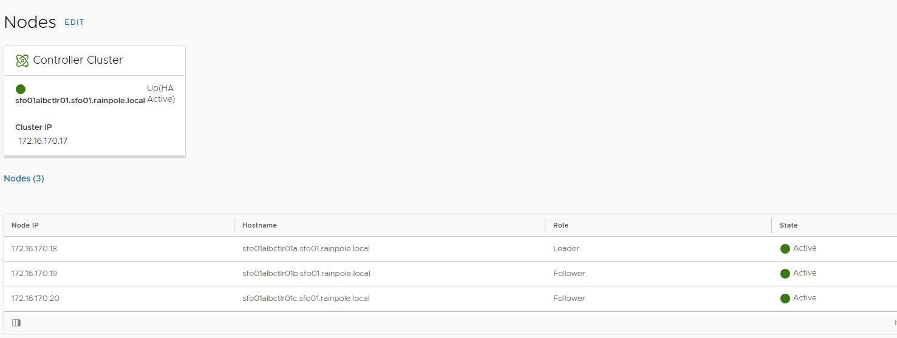

**Note:** In the following tasks, all NSX Advanced Load Balancer configurations are done by connecting to the NSX Advanced Load Balancer Controller Cluster IP/FQDN.

### NSX Advanced Load Balancer: Certificate Management

The default system-generated controller certificate generated for SSL/TSL connections will not have the required subject alternate name (SAN) entries. Complete the following steps to create a controller certificate:

1. Log in to the NSX Advanced Load Balancer controller and navigate to **Templates** > **Security** > **SSL/TLS Certificates**.

1. Click **Create** and select **Controller Certificate**. You can either generate a self-signed certificate, generate CSR, or import a certificate. For the purpose of this document, a self-signed certificate will be generated.

1. Provide all required details as per your infrastructure requirements and in the **Subject Alternate Name (SAN)** field, provide IP address and FQDN of all NSX Advanced Load Balancer controllers including NSX Advanced Load Balancer cluster IP and FQDN, and then click **Save**.

    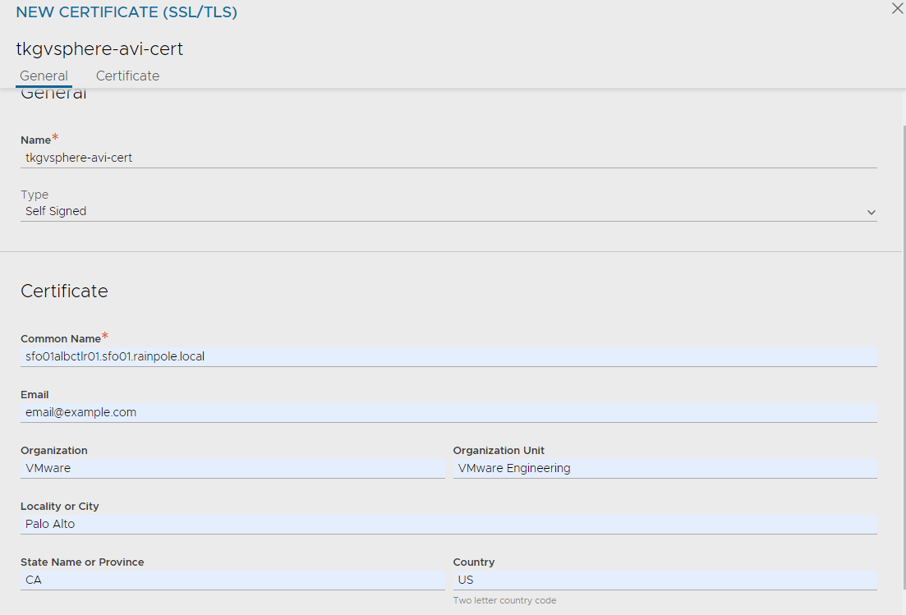

    

1. Once the certificate is created, capture the certificate contents as this is required while deploying the Tanzu Kubernetes Grid management cluster.
  To capture the certificate content, click on the Download icon next to the certificate, and then click **Copy to clipboard** under **Certificate**.

    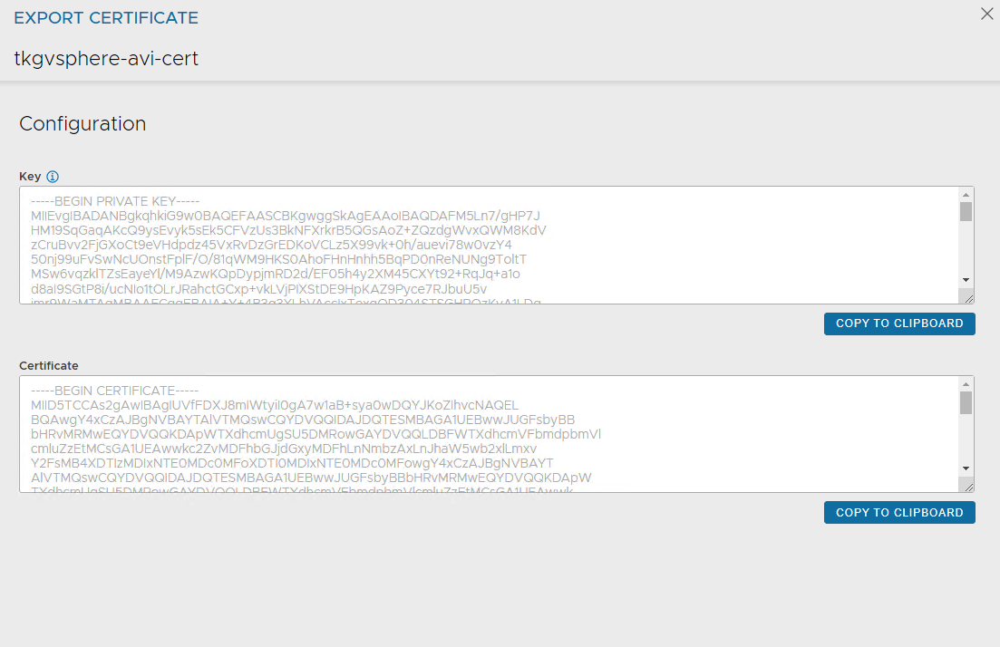

1. To replace the certificate, navigate to **Administration** > **Settings** > **Access Settings**, and click the pencil icon at the top right to edit the system access settings, and then replace the SSL/TSL certificate and click **Save**.

    

1. Log out and log in to NSX Advanced Load Balancer.

### Create Credentials

NSX Advanced Load Balancer requires credentials of VMware NSX and vCenter Server to authenticate with these endpoints. These credentials need to be created before configuring NSX Cloud.

To create a new credential, navigate to **Administration** > **User Credentials** and click **Create**.

1. Create NSX Credential: Select the credential type as NSX-T and provide a name for the credential. Under the section NSX-T Credentials, specify the username and password that NSX Advanced Load Balancer will use to authenticate with VMware NSX.


2. Create vCenter Credential: Select the credential type as vCenter and provide a name for the credential. Under the section vCenter Credentials, specify the username and password that NSX Advanced Load Balancer will use to authenticate with vCenter server.


### Create NSX Cloud and Service Engine Groups

NSX Advanced Load Balancer can be deployed in multiple environments for the same system. Each environment is called a cloud. The following procedure provides steps to create a VMware NSX cloud. As per the architecture, two service engine (SE) groups will be created.

**Service Engine Group 1**: Service engines associated with this service engine group hosts:

* Virtual services for all load balancer functionalities requested by Tanzu Kubernetes Grid management cluster and workload.
* Virtual services that load balances control plane nodes of all Tanzu Kubernetes Grid Kubernetes clusters.

**Service Engine Group 2**: Service engines associated with this service engine group hosts virtual services for all load balancer functionalities requested by Tanzu Kubernetes Grid workload clusters mapped to this SE group.  

**Note**:

* Based on your requirements, you can create additional SE groups for the workload clusters.
* Multiple workload clusters can be mapped to a single SE group.
* A Tanzu Kubernetes Grid cluster can be mapped to only one SE group for application load balancer services.

For information about mapping a specific service engine group to Tanzu Kubernetes Grid workload cluster, see [Configure NSX Advanced Load Balancer in Tanzu Kubernetes Grid Workload Cluster](#workloadako).

The following components are created in NSX Advanced Load Balancer.

<!-- /* cSpell:disable */ -->

| Object | Sample Name |
| --- | --- |
| NSX Cloud | tanzu-nsx |
| Service Engine Group 1 | sfo01m01segroup01|
| Service Engine Group 2 | sfo01w01segroup01 |

<!-- /* cSpell:enable */ -->

1.  Log in to NSX Advanced Load Balancer and navigate to **Infrastructure** > **Clouds** > **Create** > **NSX-T Cloud**.

    

2.  Enter cloud name and provide a object name prefix. Click **CHANGE CREDENTIALS** to connect NSX Advanced Load Balancer with VMware NSX.

    

3.  Specify NSX-T Manager Address and select the NSX-T credential that you created earlier.

    

4.  Under the **Management Network** pane, select the following:

    - Transport Zone: Overlay transport zone where you connected your NSX Advanced Load Balancer management network.
    - Tier-1 Router: Tier-1 gateway where Advanced Load Balancer management network is connected.
    - Overlay Segment: Logical segment that you have created for Advanced Load Balancer management.

5.  Under the **Data Networks** pane, select the following:

    - Transport Zone: Overlay transport zone where you connected your Tanzu Kubernetes Grid VIP network.
    - Tier-1 Router: Tier-1 gateway where Tanzu Kubernetes Grid VIP network is connected.
    - Overlay Segment: Logical segment that you have created for Tanzu Kubernetes Grid VIP.

    

6.  Under **vCenter Servers** pane, click **ADD**.

    

7.  Specify a name for the vCenter server and click **CHANGE CREDENTIALS** to connect NSX Advanced Load Balancer with the vCenter server.

    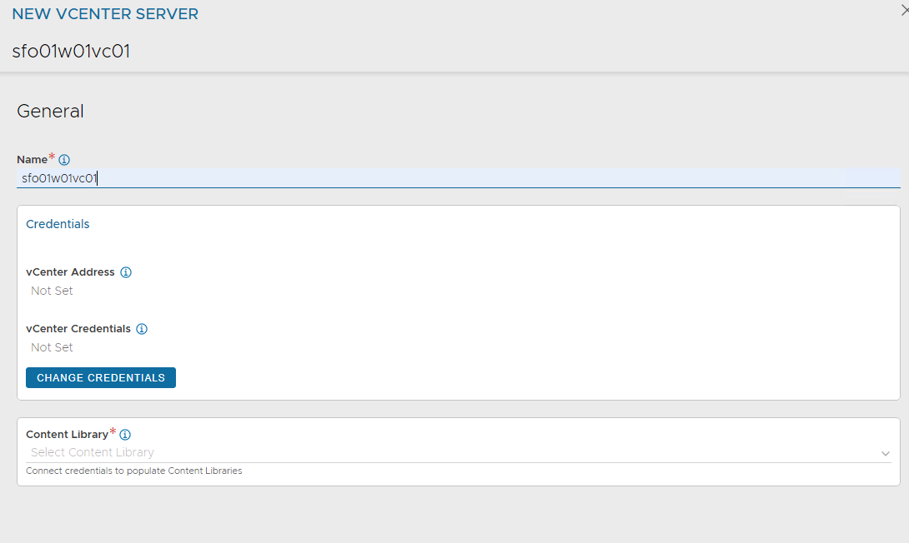

8.  Select the vCenter server from the drop down and select the vCenter credential which you have created earlier.
    
    

9.  Select the Content Library where Service Engine templates will be stored by NSX Advanced Load Balancer.
    
    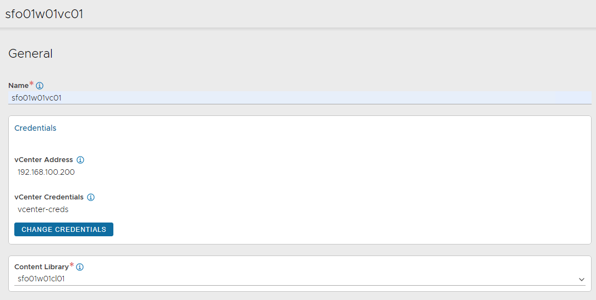

10.  Leave the IPAM/DNS profile section empty as this will be populated later, once you have created the profiles. Click **SAVE** to finish the NSX-T cloud configuration.

     

11. Ensure that status of the NSX-T cloud is Green post creation.

     

12. Create a service engine group for Tanzu Kubernetes Grid management clusters: 
    1.  Click on the Service Engine Group tab. 
    2.  Under Select Cloud, choose the cloud created in the previous step, and click **Create**.

13. Enter a name for the Tanzu Kubernetes Grid management service engine group and set the following parameters:  

    | Parameter | Value |
    | --- | --- |
    | High availability mode | Active/Active |
    | VS Placement | Compact |
    | Memory per Service Engine | 4 |
    | vCPU per Service Engine | 2 |

    Use the default values for the rest of the parameters.

    

    For advanced configuration, click on the Advanced tab. Specify the vCenter server endpoint by clicking on the Add vCenter option.

    

    Select the vCenter server from the dropdown, vSphere cluster and datastore for service engine placement, and service engine name prefix, and then click **Save**.

    

14. Repeat steps 12 and 13 to create another service engine group for Tanzu Kubernetes Grid workload clusters. Once complete, there must be two service engine groups created.

    

### Configure Network and IPAM Profile

As part of the cloud creation, NSX Advanced Load Balancer management and Tanzu Kubernetes Grid VIP networks have been configured in NSX Advanced Load Balancer. Since DHCP was not selected as the IP address management method in the cloud configuration, you have to specify pool of IP addresses that can be assigned to the service engine NICs and the virtual services that will be created in future.

To configure IP address pools for the networks, follow this procedure:

1. Navigate to **Infrastructure** > **Networks** and select the cloud that you have created earlier.

   

2. Click on the edit icon next for the network and configure as follows. Change the provided details as per your SDDC configuration.

   |**Network Name**|**DHCP** |**Subnet**|**Static IP Pool**|
   | --- | --- | --- | --- |
   |sfo01-w01-vds01-albmanagement|No|172.16.170.0/24|172.16.170.10 - 172.16.170.200|
   |sfo01-w01-vds01-tkgclustervip|No|172.16.180.0/24|172.16.180.10 - 172.16.180.200|

   The following snippet shows configuring one of the networks. For example: `sfo01-w01-vds01-albmanagement`

   **Note**: Ensure that VRF Context for `sfo01-w01-vds01-albmanagement` network is set to `Global`.

   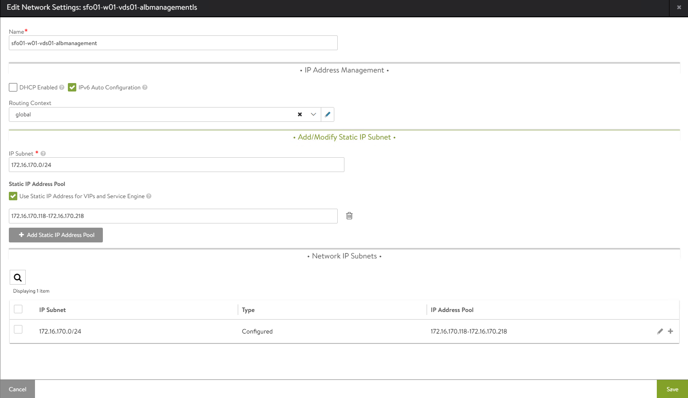

   Edit the `sfo01-w01-vds01-tkgclustervip` network and configure as following. The VRF Context for VIP network is set to NSX tier-1 gateway.

   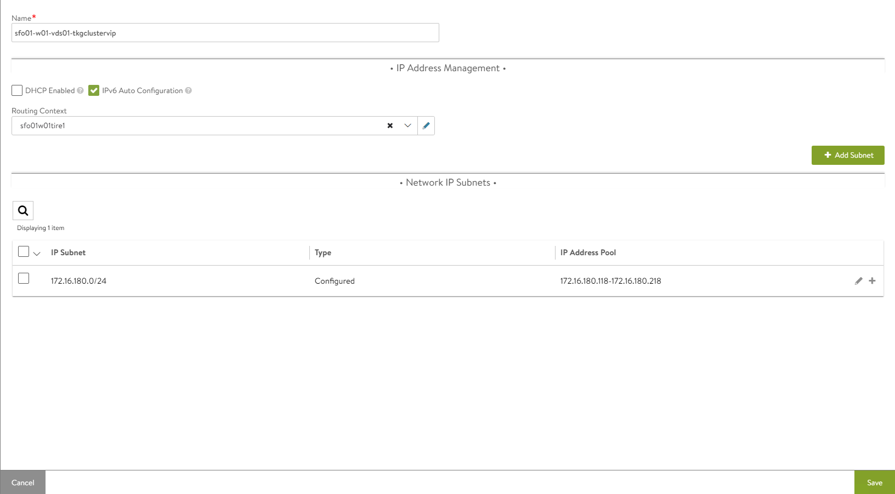

   Once the networks are configured, the configuration must look like the following image.

   

3. Once the networks are configured, set the default routes for the networks by navigating to **Infrastructure** > **Routing**.

   The default gateway for the `sfo01-w01-vds01-albmanagement` network is set in the global VRF context and for the `sfo01-w01-vds01-tkgclustervip` network, the VRF Context is set to NSX tier-1 gateway.

   To set the default gateway for the `asfo01-w01-vds01-albmanagement` network, click **CREATE** under the global VRF context and set the default gateway to gateway of the NSX Advanced Load Balancer management subnet.

   

      To set the default gateway for the `sfo01-w01-vds01-tkgclustervip` network, click **CREATE** under the tier-1 gateway VRF context and set the default gateway to gateway of the VIP network subnet.

   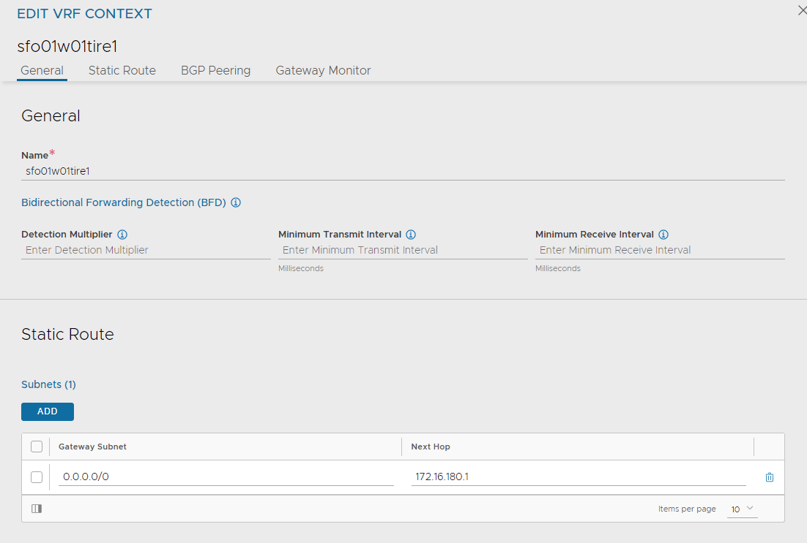

   The final configuration is shown below:

   

#### Create IPAM Profile in NSX Advanced Load Balancer and Attach to Cloud

At this point, all the required networks related to Tanzu functionality are configured in NSX Advanced Load Balancer. NSX Advanced Load Balancer provides IPAM service for Tanzu Kubernetes Grid cluster VIP network and NSX ALB management network.  

Complete the following steps to create an IPAM profile and once created, attach it to the NSX-T cloud created earlier.  

1. Log in to NSX Advanced Load Balancer and navigate to **Templates** > **IPAM/DNS Profiles** > **Create** > **IPAM Profile**.

   

   Provide the following details, and then click **Save**.

     |**Parameter**|**Value**|
     | --- | --- |
     |Name|sfo01-w01-ipam01|
     |Type|AVI Vintage IPAM|
     |Cloud for Usable Networks|sfo01w01vc01|
     |Usable Networks|sfo01-w01-vds01-management<br>sfo01-w01-vds01-tkgworkloadvip|

    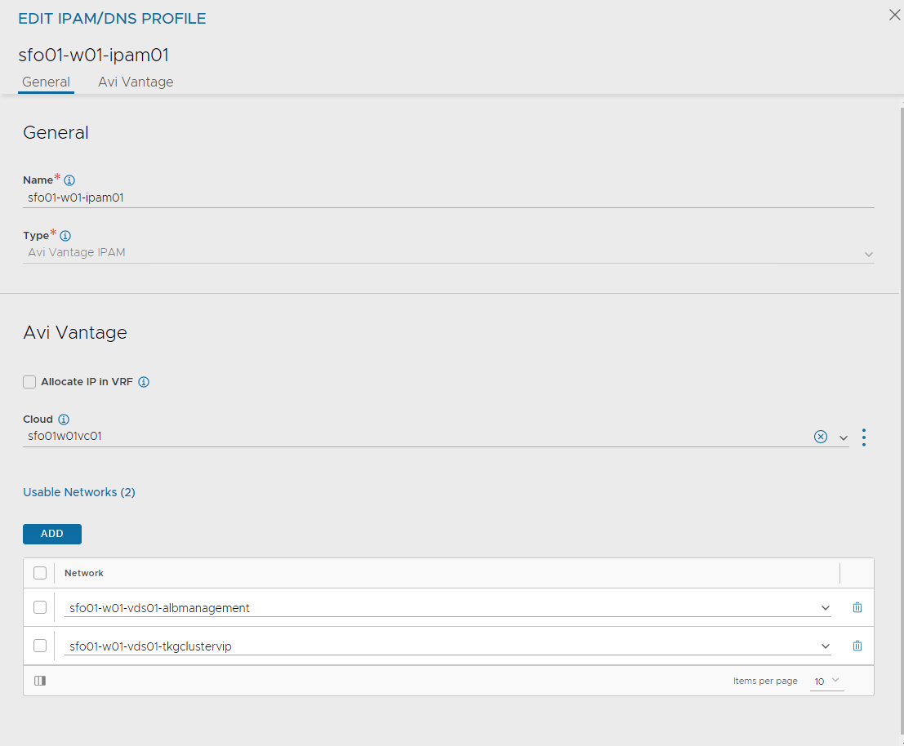

2. Click **Create** > **DNS Profile** and provide the domain name.

   

3. Attach the IPAM and DNS profiles to the NSX-T cloud.
    1. Navigate to **Infrastructure** > **Clouds**.
    2. Edit the `tanzu-nsx` cloud.
    3. Under IPAM/DNS section, choose the IPAM and DNS profiles created earlier and save the updated configuration.  

     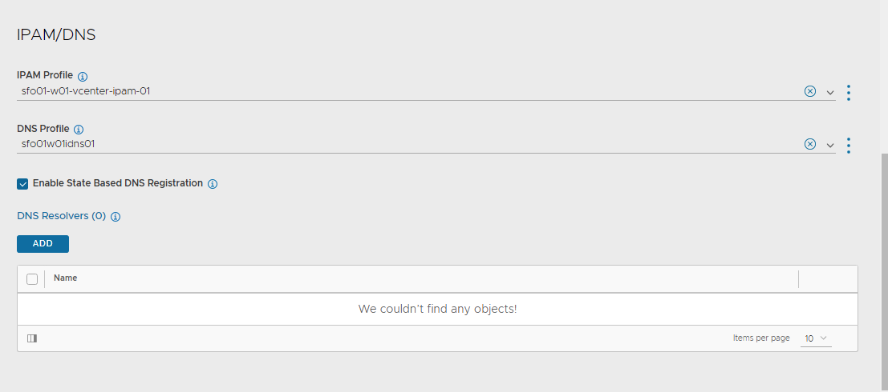

4. Under the section **DNS Resolvers**, click **ADD** to add the DNS server that NSX-T cloud will use to resolve the hostname or FQDN of the components that will be created later.

     

   Enter a name for the DNS and click **ADD** under **Name Servers** to add your infrastructure DNS servers. Optionally, you can specify the TTL for the DNS.

    

This completes the NSX Advanced Load Balancer configuration. The next step is to deploy and configure a bootstrap machine which will be used to deploy and manage Tanzu Kubernetes clusters.

## <a id="configurebootstrap"> </a> Deploy and Configure Bootstrap Machine

The deployment of the Tanzu Kubernetes Grid management and workload clusters is facilitated by setting up a bootstrap machine where you install the Tanzu CLI and Kubectl utilities which are used to create and manage the Tanzu Kubernetes Grid instance. This machine also keeps the Tanzu Kubernetes Grid and Kubernetes configuration files for your deployments. The bootstrap machine can be a laptop, host, or server running on Linux, macOS, or Windows that you deploy management and workload clusters from.

The bootstrap machine runs a local `kind` cluster when Tanzu Kubernetes Grid management cluster deployment is started. Once the `kind` cluster is fully initialized, the configuration is used to deploy the actual management cluster on the backend infrastructure. After the management cluster is fully configured, the local `kind` cluster is deleted and future configurations are performed with the Tanzu CLI.

For this deployment, a Photon-based virtual machine is used as the bootstrap machine. For information on how to configure for a macOS or Windows machine, see [Install the Tanzu CLI and Other Tools](https://docs.vmware.com/en/VMware-Tanzu-Kubernetes-Grid/2/using-tkg-2/GUID-install-cli.html).

The bootstrap machine must meet the following prerequisites:

   * A minimum of 6 GB of RAM and a 2-core CPU.
   * System time is synchronized with a Network Time Protocol (NTP) server.
   * Docker and containerd binaries are installed. For instructions on how to install Docker, see [Docker documentation](https://docs.docker.com/engine/install/centos/).
   * Ensure that the bootstrap VM is connected to Tanzu Kubernetes Grid management network, `sfo01-w01-vds01-tkgmanagement`.

To install Tanzu CLI, Tanzu Plugins, and Kubectl utility on the bootstrap machine, follow the instructions below:

1. Download and unpack the following Linux CLI packages from [VMware Tanzu Kubernetes Grid Download Product page](https://customerconnect.vmware.com/downloads/info/slug/infrastructure_operations_management/vmware_tanzu_kubernetes_grid/2_x).

   * VMware Tanzu CLI 2.1.0 for Linux
   * kubectl cluster cli v1.24.9 for Linux

1. Execute the following commands to install Tanzu Kubernetes Grid CLI, kubectl CLIs, and Carvel tools.
    ```bash
    ## Install required packages
    tdnf install tar zip unzip wget -y

    ## Install Tanzu Kubernetes Grid CLI
    tar -xvf tanzu-cli-bundle-linux-amd64.tar.gz
    cd ./cli/
    sudo install core/v0.28.0/tanzu-core-linux_amd64 /usr/local/bin/tanzu
    chmod +x /usr/local/bin/tanzu

    ## Verify Tanzu CLI version

     [root@tkg160-bootstrap ~] # tanzu version

    version: v0.28.0
    buildDate: 2023-01-20
    sha: 3c34115bc-dirty

    ## Install Tanzu Kubernetes Grid CLI Plugins

    [root@tkg160-bootstrap ~] # tanzu plugin sync

    Checking for required plugins...
    Installing plugin 'login:v0.28.0'
    Installing plugin 'management-cluster:v0.28.0'
    Installing plugin 'package:v0.28.0'
    Installing plugin 'pinniped-auth:v0.28.0'
    Installing plugin 'secret:v0.28.0'
    Installing plugin 'telemetry:v0.28.0'
    Successfully installed all required plugins
    ✔  Done

    ## Verify the plugins are installed

    [root@tkg160-bootstrap ~]# tanzu plugin list
    NAME                DESCRIPTION                                                        SCOPE       DISCOVERY  VERSION  STATUS
    login               Login to the platform                                              Standalone  default    v0.28.0  installed
    management-cluster  Kubernetes management-cluster operations                           Standalone  default    v0.28.0  installed
    package             Tanzu package management                                           Standalone  default    v0.28.0  installed
    pinniped-auth       Pinniped authentication operations (usually not directly invoked)  Standalone  default    v0.25.0  installed
    secret              Tanzu secret management                                            Standalone  default    v0.28.0  installed
    telemetry           Configure cluster-wide telemetry settings                          Standalone  default    v0.28.0  installed


    ## Install Kubectl CLI
    gunzip kubectl-linux-v1.24.9+vmware.1.gz
    mv kubectl-linux-v1.24.9+vmware.1 /usr/local/bin/kubectl && chmod +x /usr/local/bin/kubectl

    # Install Carvel tools

    ##Install ytt
    cd ./cli
    gunzip ytt-linux-amd64-v0.43.1+vmware.1.gz
    chmod ugo+x ytt-linux-amd64-v0.43.1+vmware.1 &&  mv ./ytt-linux-amd64-v0.43.1+vmware.1 /usr/local/bin/ytt

    ##Install kapp

    cd ./cli
    gunzip kapp-linux-amd64-v0.53.2+vmware.1.gz
    chmod ugo+x kapp-linux-amd64-v0.53.2+vmware.1 && mv ./kapp-linux-amd64-v0.53.2+vmware.1 /usr/local/bin/kapp

    ##Install kbld

    cd ./cli
    gunzip kbld-linux-amd64-v0.35.1+vmware.1.gz
    chmod ugo+x kbld-linux-amd64-v0.35.1+vmware.1 && mv ./kbld-linux-amd64-v0.35.1+vmware.1 /usr/local/bin/kbld

    ##Install impkg

    cd ./cli
    gunzip imgpkg-linux-amd64-v0.31.1+vmware.1.gz
    chmod ugo+x imgpkg-linux-amd64-v0.31.1+vmware.1 && mv ./imgpkg-linux-amd64-v0.31.1+vmware.1 /usr/local/bin/imgpkg
    ```

1. Validate Carvel tools installation using the following commands.

    ```bash
    ytt version
    kapp version
    kbld version
    imgpkg version
    ```

1. Install `yq`. `yq` is a lightweight and portable command-line YAML processor. `yq` uses `jq`-like syntax but works with YAML and JSON files.

    ```bash
    wget https://github.com/mikefarah/yq/releases/download/v4.24.5/yq_linux_amd64.tar.gz

    tar -xvf yq_linux_amd64.tar.gz && mv yq_linux_amd64 /usr/local/bin/yq
    ```

1. Install `kind`.

    ```bash
    curl -Lo ./kind https://kind.sigs.k8s.io/dl/v0.11.1/kind-linux-amd64
    chmod +x ./kind
    mv ./kind /usr/local/bin/kind
    ```

1. Execute the following commands to start the Docker service and enable it to start at boot. Photon OS has Docker installed by default.

    ```bash
    ## Check Docker service status
    systemctl status docker

    ## Start Docker Service
    systemctl start docker

    ## To start Docker Service at boot
    systemctl enable docker
    ```

1. Execute the following commands to ensure that the bootstrap machine uses [cgroup v1](https://man7.org/linux/man-pages/man7/cgroups.7.html).

    ```bash
    docker info | grep -i cgroup

    ## You should see the following
    Cgroup Driver: cgroupfs
    ```

1. Create an SSH key pair.

   An SSH key pair is required for Tanzu CLI to connect to vSphere from the bootstrap machine.  

   The public key part of the generated key is passed during the Tanzu Kubernetes Grid management cluster deployment.

   ```bash
   ## Generate SSH key pair
   ## When prompted enter file in which to save the key (/root/.ssh/id_rsa): press Enter to accept the default and provide password
   ssh-keygen -t rsa -b 4096 -C "email@example.com"

   ## Add the private key to the SSH agent running on your machine and enter the password you created in the previous step
   ssh-add ~/.ssh/id_rsa
   ## If the above command fails, execute "eval $(ssh-agent)" and then rerun the command
   ```

1. If your bootstrap machine runs Linux or Windows Subsystem for Linux, and it has a Linux kernel built after the May 2021 Linux security patch, for example Linux 5.11 and 5.12 with Fedora, run the following command.

   ```
    sudo sysctl net/netfilter/nf_conntrack_max=131072
   ```

All required packages are now installed and the required configurations are in place in the bootstrap virtual machine. The next step is to deploy the Tanzu Kubernetes Grid management cluster.

### <a id="importbaseimage"> </a> Import Base Image Template for Tanzu Kubernetes Grid Cluster Deployment

Before you proceed with the management cluster creation, ensure that the base image template is imported into vSphere and is available as a template. To import a base image template into vSphere:

1. Go to the [Tanzu Kubernetes Grid downloads page](https://customerconnect.vmware.com/downloads/info/slug/infrastructure_operations_management/vmware_tanzu_kubernetes_grid/2_x) and download a Tanzu Kubernetes Grid OVA for the cluster nodes.

* For the management cluster, this must be either Photon or Ubuntu based Kubernetes v1.24.9 OVA.

     **Note**: Custom OVA with a custom Tanzu Kubernetes release (TKr) is also supported, as described in [Build Machine Images](https://docs.vmware.com/en/VMware-Tanzu-Kubernetes-Grid/2.1/tkg-deploy-mc-21/mgmt-byoi-index.html).
* For workload clusters, OVA can have any supported combination of OS and Kubernetes version, as packaged in a Tanzu Kubernetes release.

    **Note**: Make sure you download the most recent OVA base image templates in the event of security patch releases. You can find updated base image templates that include security patches on the Tanzu Kubernetes Grid product download page.

1. In the vSphere client, right-click an object in the vCenter Server inventory and select **Deploy OVF template**.

1. Select Local file, click the button to upload files, and go to the downloaded OVA file on your local machine.

1. Follow the installer prompts to deploy a VM from the OVA.

1. Click **Finish** to deploy the VM. When the OVA deployment finishes, right-click the VM and select **Template** > **Convert to Template**.

    **Note:** Do not power on the VM before you convert it to a template.

1. **If using non administrator SSO account**: In the VMs and Templates view, right-click the new template, select **Add Permission**, and assign the **tkg-user** to the template with the **TKG role**.

For information about how to create the user and role for Tanzu Kubernetes Grid, see [Required Permissions for the vSphere Account](https://docs.vmware.com/en/VMware-Tanzu-Kubernetes-Grid/2.1/tkg-deploy-mc-21/mgmt-reqs-prep-vsphere.html).

## <a id="deploy-mgmt-cluster"> </a> Deploy Tanzu Kubernetes Grid Management Cluster

The management cluster is a Kubernetes cluster that runs Cluster API operations on a specific cloud provider to create and manage workload clusters on that provider.

The management cluster is also where you configure the shared and in-cluster services that the workload clusters use.

You can deploy management clusters in two ways:

- Run the Tanzu Kubernetes Grid installer, a wizard interface that guides you through the process of deploying a management cluster. This is the recommended method.
- Create and edit YAML configuration files, and use them to deploy a management cluster with the CLI commands.

The following procedure provides the required steps to deploy Tanzu Kubernetes Grid management cluster using the installer interface.

1. To launch the UI installer wizard, run the following command on the bootstrap machine:  

    `tanzu management-cluster create --ui --bind <bootstrapper-ip>:<port> --browser none`  

    For example:  
    `tanzu management-cluster create --ui --bind 172.19.10.4:8000 --browser none` 

1. Access Tanzu UI wizard by opening a browser and entering: http://<bootstrapper-ip:port/  

 	 

1. On the VMware vSphere tile, click **DEPLOY**.

1. In the IaaS Provider section, enter the IP address/FQDN and credentials of the vCenter server where the Tanzu Kubernetes Grid management cluster will be deployed. (Optional) you can skip the vCenter SSL thumbprint verification.

   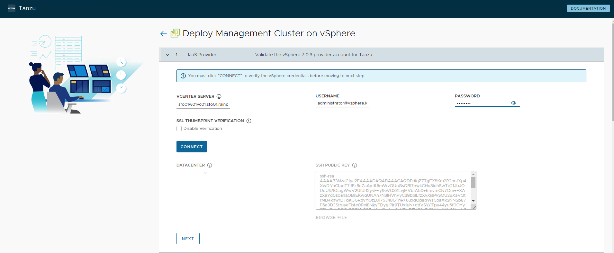

1. Click **CONNECT** and select "DEPLOY TKG MANAGEMENT CLUSTER".

     

1. Select the data center and provide the SSH public Key generated while configuring the bootstrap VM.  
    If you have saved the SSH key in the default location, run the following command in your bootstrap machine to get the SSH public key.

    `cat /root/.ssh/id_rsa.pub`

1. Click **NEXT**.

    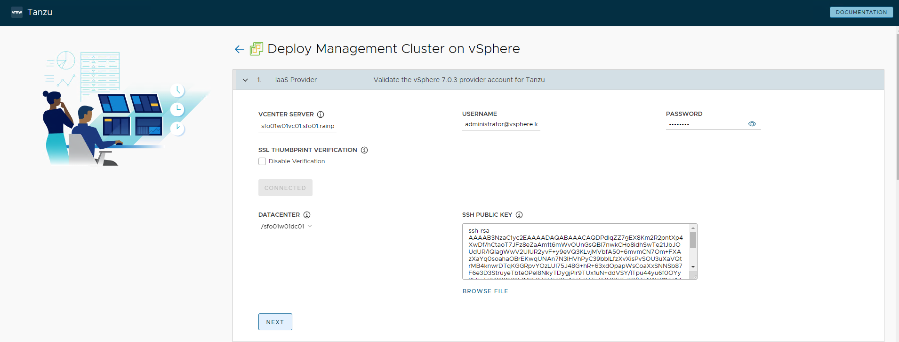

1. On the Management Cluster Settings section, provide the following details and click **Next**.

    * Based on the environment requirements, select appropriate deployment type for the Tanzu Kubernetes Grid management cluster:

        * Development: Recommended for Dev or POC environments

        * Production: Recommended for Production environments

        It is recommended to set the instance type to `Large` or above. For the purpose of this document, we will proceed with deployment type `Production` and instance type `Medium`.

    * Management Cluster Name: Name for your management cluster.
    * Control Plane Endpoint Provider: Select NSX Advanced Load Balancer for Control Plane HA.
    * Control Plane Endpoint: This is an optional field. If left blank, NSX Advanced Load Balancer will assign an IP address from the pool defined for the network "sfo01-w01-vds01-tkgclustervip".  
        If you need to provide an IP address, pick an IP address from “sfo01-w01-vds01-tkgclustervip”  static IP pools configured in AVI and ensure that the IP address is unused.
    * Machine Health Checks: Enable
    * Enable Audit Logging: Enable for audit logging for Kubernetes API server and node VMs. Choose as per your environment needs. For more information, see [Audit Logging](https://docs.vmware.com/en/VMware-Tanzu-Kubernetes-Grid/2.1/using-tkg-21/workload-security-audit-log.html).

    

1. On the NSX Advanced Load Balancer section, provide the following information and click **Next**.

    * Controller Host: NSX Advanced Load Balancer Controller IP/FQDN (ALB Controller cluster IP/FQDN of the controller cluster is configured)
    * Controller credentials: Username and Password of NSX Advanced Load Balancer
    * Controller certificate: Paste the contents of the Certificate Authority that is used to generate your controller certificate into the **Controller Certificate Authority** text box.

    

1. Once these details are provided, click **VERIFY CREDENTIALS** and choose the following parameters.

    * Cloud Name: Name of the cloud created while configuring NSX Advanced Load Balancer `sfo01w01vc01`.
    * Workload Cluster Service Engine Group Name: Name of the service engine group created for Tanzu Kubernetes Grid workload clusters created while configuring NSX Advanced Load Balancer `sfo01-w01-vds01-tkgworkload`.
    * Workload Cluster Data Plane VIP Network Name: Select `sfo01-w01-vds01-tkgclustervip` network and the subnet associated with it.
    * Workload Cluster Control Plane VIP Network Name: Select `sfo01-w01-vds01-tkgclustervip` network and the subnet associated with it.
    * Management Cluster Service Engine Group Name: Name of the service engine group created for Tanzu Kubernetes Grid management cluster created while configuring NSX Advanced Load Balancer `sfo01m01segroup01`.
    * Management Cluster Data Plane VIP network Name: Select `sfo01-w01-vds01-tkgclustervip` network and the subnet associated with it.
    * Management Cluster Control Plane VIP network Name: Select `sfo01-w01-vds01-tkgclustervip` network and the subnet associated with it.
    * Cluster Labels: To adhere to the architecture defining a label is mandatory. Provide required labels, for example, `type: management`.

		**Note:** Based on your requirements, you may specify multiple labels.

         

   **Note:** With above configurations, when Tanzu Kubernetes Grid clusters (shared services or workload) are tagged with label `type: management`, `ako` pod gets deployed on the cluster, and any applications hosted on the cluster that requires the load balancing service is exposed through network `sfo01-w01-vds01-tkgclustervip` and the virtual service is placed on SE group `sfo01m01segroup01`.
                
1. (Optional) On the Metadata page, you can specify location and labels and click **Next**.

    

1. On the Resources section, specify the resources to be consumed by the Tanzu Kubernetes Grid management cluster and click **NEXT**.

    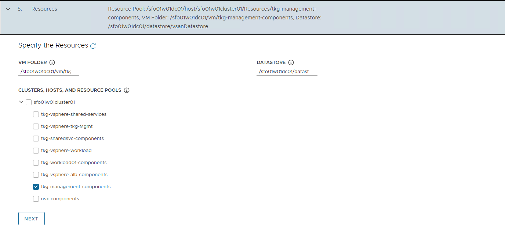

1. On the Kubernetes Network section, select the Tanzu Kubernetes Grid management network (`sfo01-w01-vds01-tkgmanagement`) where the control plane and worker nodes will be placed during management cluster deployment. Ensure that the network has DHCP service enabled. Optionally, change the pod and service CIDR.

    If the Tanzu environment is placed behind a proxy, enable proxy and provide proxy details:

    * If you set `http-proxy`, you must also set `https-proxy` and vice-versa.
    * For the `no-proxy` section:

      * For Tanzu Kubernetes Grid management and workload clusters, `localhost`, `127.0.0.1`, the values of `CLUSTER_CIDR` and `SERVICE_CIDR`, `.svc`, and `.svc.cluster.local` are appended along with the user specified values.
    * **Note**: If the Kubernetes cluster needs to communicate with external services and infrastructure endpoints in your Tanzu Kubernetes Grid environment, ensure that those endpoints are reachable by your proxies or add them to `TKG_NO_PROXY`. Depending on your environment configuration, this may include, but is not limited to, your OIDC or LDAP server, Harbor, NSX, NSX Advanced Load Balancer, and vCenter.
    * For vSphere, you must manually add the CIDR of Tanzu Kubernetes Grid management network and Cluster VIP networks that includes the IP address of your control plane endpoints, to `TKG_NO_PROXY`.

    

1. (Optional) Specify identity management with OIDC or LDAP. For the purpose of this document, identity management integration is deactivated.

    If you would like to enable identity management, see **Enable and Configure Identity Management During Management Cluster Deployment** section in the Tanzu Kubernetes Grid Integration with Pinniped Deployment Guide.

      

1. Select the OS image that will be used for the management cluster deployment.

    Note: This list will appear empty if you don’t have a compatible template present in your environment. Refer steps provided in [Import Base Image template for TKG Cluster deployment](https://docs.vmware.com/en/VMware-Tanzu-Kubernetes-Grid/2.1/tkg-deploy-mc-21/mgmt-reqs-prep-vsphere.html).

    

1. Select “Participate in the Customer Experience Improvement Program”, if you so desire.

   

1. Click **REVIEW CONFIGURATION**.

   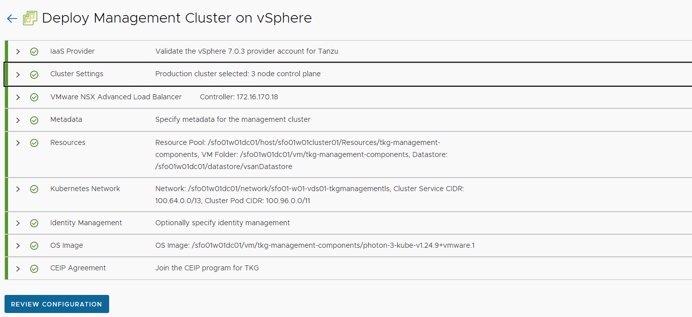

    As of now, it is not possible to deploy management cluster for NSX cloud from the Tanzu Kubernetes Grid installer UI as one of the required field for NSX cloud is not exposed in the UI and it needs to be manually inserted in the cluster deployment yaml.

1. Click on **EXPORT CONFIGURATION** to download the deployment yaml file.

   

1. Edit the file and insert the key `AVI_NSXT_T1LR`. The value of this key is the tier-1 gateway where you have connected the `sfo01-w01-vds01-tkgmanagement` network. In this example, the value is set to `tanzu-t1-gw`.
1. Deploy the Management cluster from this config file by running the command:<p>tanzu management-cluster create -f example.yaml  -v 6

A sample file used for the management cluster deployment is shown below.

```yaml
AVI_CA_DATA_B64: LS0tLS1CRUdJTiBDRVJUSU....z0KLS0tLS1FTkQgQ0VSVElGSUNBVEUtLS0tLQ==
AVI_CLOUD_NAME: sfo01w01vc01
AVI_CONTROL_PLANE_HA_PROVIDER: "true"
AVI_CONTROL_PLANE_NETWORK: sfo01-w01-vds01-tkgclustervip
AVI_CONTROL_PLANE_NETWORK_CIDR: 172.16.180.0/24
AVI_CONTROLLER: sfo01albctlr01.sfo01.rainpole.local
AVI_DATA_NETWORK: sfo01-w01-vds01-tkgclustervip
AVI_DATA_NETWORK_CIDR: 172.16.180.0/24
AVI_ENABLE: "true"
AVI_LABELS: |
    'type': 'management'
AVI_MANAGEMENT_CLUSTER_CONTROL_PLANE_VIP_NETWORK_CIDR: 172.16.180.0/24
AVI_MANAGEMENT_CLUSTER_CONTROL_PLANE_VIP_NETWORK_NAME: sfo01-w01-vds01-tkgclustervip
AVI_MANAGEMENT_CLUSTER_SERVICE_ENGINE_GROUP: sfo01m01segroup01
AVI_MANAGEMENT_CLUSTER_VIP_NETWORK_CIDR: 172.16.180.0/24
AVI_MANAGEMENT_CLUSTER_VIP_NETWORK_NAME: sfo01-w01-vds01-tkgclustervip
AVI_NSXT_T1LR: /infra/tier-1s/tanzu-t1-gw
AVI_PASSWORD: <encoded:Vk13YXJlMSE=>
AVI_SERVICE_ENGINE_GROUP: sfo01w01segroup01
AVI_USERNAME: admin
CLUSTER_CIDR: 100.96.0.0/11
CLUSTER_NAME: tkgmgmtnsxt
CLUSTER_PLAN: prod
ENABLE_AUDIT_LOGGING: "false"
ENABLE_CEIP_PARTICIPATION: "false"
ENABLE_MHC: "true"
IDENTITY_MANAGEMENT_TYPE: none
INFRASTRUCTURE_PROVIDER: vsphere
OS_ARCH: amd64
OS_NAME: photon
OS_VERSION: "3"
SERVICE_CIDR: 100.64.0.0/13
TKG_HTTP_PROXY_ENABLED: "false"
VSPHERE_CONTROL_PLANE_DISK_GIB: "40"
VSPHERE_CONTROL_PLANE_ENDPOINT: ""
VSPHERE_CONTROL_PLANE_MEM_MIB: "8192"
VSPHERE_CONTROL_PLANE_NUM_CPUS: "2"
VSPHERE_DATACENTER: /sfo01w01dc01
VSPHERE_DATASTORE: /sfo01w01dc01/datastore/vsanDatastore
VSPHERE_FOLDER: /sfo01w01dc01/vm/tkg-vsphere-tkg-mgmt
VSPHERE_INSECURE: "true"
VSPHERE_NETWORK: /sfo01w01dc01/network/sfo01-w01-vds01-tkgmanagement
VSPHERE_PASSWORD: <encoded:Vk13YXJlMSE=>
VSPHERE_RESOURCE_POOL: /sfo01w01dc01/host/sfo01w01cluster01/Resources/tkg-vsphere-tkg-mgmt
VSPHERE_SERVER: sfo01w01vc01.sfo01.rainpole.local
VSPHERE_SSH_AUTHORIZED_KEY: ssh-rsa AAAAB3NzaC1yc2....zyr3RvifuokfrQ== manish@vmware
VSPHERE_TLS_THUMBPRINT: ""
VSPHERE_USERNAME: administrator@vsphere.local
VSPHERE_WORKER_DISK_GIB: "40"
VSPHERE_WORKER_MEM_MIB: "8192"
VSPHERE_WORKER_NUM_CPUS: "2"
CONTROL_PLANE_MACHINE_COUNT: "3"
WORKER_MACHINE_COUNT: "3"
DEPLOY_TKG_ON_VSPHERE7: true
```
While the cluster is being deployed, you will find that a virtual service is created in NSX Advanced Load Balancer and new service engines are deployed in vCenter by NSX Advanced Load Balancer and the service engines are mapped to the SE Group `sfo01-w01-vds01-tkgmanagement`.​​

The installer automatically sets the context to the Tanzu Kubernetes Grid management cluster on the bootstrap machine. Now, you can access the Tanzu Kubernetes Grid management cluster from the bootstrap machine and perform additional tasks such as verifying the management cluster health, deploying the workload clusters, etc.

To get the status of Tanzu Kubernetes Grid management cluster, run the following command:

`tanzu management-cluster get`

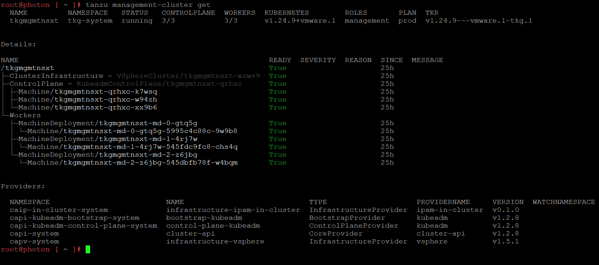

Use `kubectl get nodes` command to get the status of the Tanzu Kubernetes Grid management cluster nodes.


The Tanzu Kubernetes Grid management cluster is successfully deployed and now you can proceed with registering it with Tanzu Mission Control and creating shared services and workload clusters.

## What to Do Next

### <a id="tmc-integration"> </a> Register Management Cluster with Tanzu Mission Control

If you want to register your management cluster with Tanzu Mission Control, see [Register Your Management Cluster with Tanzu Mission Control](tko-saas-services.md#tmc-tkg-mgmt).

## <a id="workloadalb"> </a> Configure AKO Deployment Config (ADC) for Workload Clusters

Tanzu Kubernetes Grid v2.1.0 management clusters with NSX Advanced Load Balancer are deployed with 2 AKODeploymentConfigs.

* `install-ako-for-management-cluster`: default configuration for management cluster
* `install-ako-for-all`:  default configuration for all workload clusters. By default, all the workload clusters reference this file for their virtual IP networks and service engine (SE) groups. This ADC configuration does not enable NSX L7 Ingress by default.

As per this Tanzu deployment, create two more ADCs:

* `tanzu-ako-for-shared`: Used by shared services cluster to deploy the virtual services in `TKG Mgmt SE Group` and  the loadbalancer applications in `TKG Management VIP Network`.

* `tanzu-ako-for-workload-L7-ingress`: Use this ADC only if you would like to enable NSX Advanced Load Balancer L7 ingress on workload cluster. Otherwise, leave the cluster labels empty to apply the network configuration from default ADC `install-ako-for-all`.

### <a id="sharedako"> </a> Configure AKODeploymentConfig (ADC) for Shared Services Cluster

As per the defined architecture, shared services cluster uses the same control plane and data plane network as the management cluster. Shared services cluster control plane endpoint uses `TKG Cluster VIP Network`, application loadbalancing uses `TKG Management Data VIP network` and the virtual services are deployed in `tanzu-mgmt-segroup-01` SE group. This configuration is enforced by creating a custom AKO Deployment Config (ADC) and applying the respective `AVI_LABELS` while deploying the shared services cluster.

The format of the AKODeploymentConfig YAML file is as follows.

<!-- /* cSpell:disable */ -->
```yaml
apiVersion: networking.tkg.tanzu.vmware.com/v1alpha1
kind: AKODeploymentConfig
metadata:
  finalizers:
     - ako-operator.networking.tkg.tanzu.vmware.com
  generation: 2
  name: <Unique name of AKODeploymentConfig>
spec:
  adminCredentialRef:
    name: nsx-alb-controller-credentials
    namespace: tkg-system-networking
  certificateAuthorityRef:
    name: nsx-alb-controller-ca
    namespace: tkg-system-networking
  cloudName: <NAME OF THE CLOUD in ALB>
  clusterSelector:
    matchLabels:
      <KEY>: <VALUE>
  controlPlaneNetwork:
    cidr: <TKG-Cluster-VIP-CIDR>
    Name: <TKG-Cluster-VIP-Network>
  controller: <NSX ALB CONTROLLER IP/FQDN>
  dataNetwork:
    cidr: <TKG-Mgmt-Data-VIP-CIDR>
    name: <TKG-Mgmt-Data-VIP-Name>
  extraConfigs:
   cniPlugin: antrea
   disableStaticRouteSync: true
   ingress:
      defaultIngressController: false
      disableIngressClass: true
      nodeNetworkList:
      - networkName: <TKG-Mgmt-Network>     
  serviceEngineGroup: <Mgmt-Cluster-SEG>

```
<!-- /* cSpell:enable */ -->

The sample AKODeploymentConfig with sample values in place is as follows. You should add the respective NSX ALB label `type=shared-services` while deploying shared services cluster to enforce this network configuration.

* cloud: ​`sfo01w01vc01​`
* service engine group: `sfo01m01segroup01`
* Control Plane network: `sfo01-w01-vds01-tkgclustervip`
* VIP/data network: `sfo01-w01-vds01-tkgclustervip`
* Node Network: `sfo01-w01-vds01-tkgmanagement`

<!-- /* cSpell:disable */ -->
```yaml
apiVersion: networking.tkg.tanzu.vmware.com/v1alpha1
kind: AKODeploymentConfig
metadata:
  finalizers:
  - ako-operator.networking.tkg.tanzu.vmware.com
  generation: 2
  labels:
  name: tanzu-ako-for-shared
spec:
  adminCredentialRef:
    name: NSXALB-controller-credentials
    namespace: tkg-system-networking
  certificateAuthorityRef:
    name: NSXALB-controller-ca
    namespace: tkg-system-networking
  cloudName: sfo01w01vc01
  clusterSelector:
    matchLabels:
      type: shared-services
  controlPlaneNetwork:
    cidr: 172.16.180.0/24
    name: sfo01-w01-vds01-tkgclustervip
  controller: sfo01albctlr01.sfo01.rainpole.local
  dataNetwork:
    cidr: 172.16.180.0/24
    name: sfo01-w01-vds01-tkgclustervip
  extraConfigs:
    cniPlugin: antrea
    disableStaticRouteSync: true
    ingress:
      defaultIngressController: false
      disableIngressClass: true
      nodeNetworkList:
      - networkName: sfo01-w01-vds01-tkgmanagement
  serviceEngineGroup: sfo01m01segroup01
```
<!-- /* cSpell:enable */ -->

After you have the AKO configuration file ready, use the `kubectl` command to set the context to Tanzu Kubernetes Grid management cluster and create the ADC:

<!-- /* cSpell:disable */ -->
```
# kubectl config use-context sfo01w01vc01-admin@sfo01w01vc01
Switched to context "sfo01w01vc01-admin@sfo01w01vc01".


# kubectl apply -f ako-shared-services.yaml
akodeploymentconfig.networking.tkg.tanzu.vmware.com/tanzu-ako-for-shared created
```
<!-- /* cSpell:enable */ -->

Use the following command to list all AKODeploymentConfig created under the management cluster:

<!-- /* cSpell:disable */ -->
```
# kubectl get adc
NAME                                 AGE
install-ako-for-all                  21h
install-ako-for-management-cluster   21h
tanzu-ako-for-shared                 113s
```
<!-- /* cSpell:enable */ -->

### <a id="l7workloadako"> </a> Configure AKO Deployment Config (ADC) for Workload Cluster to Enable NSX ALB L7 Ingress with NodePortLocal Mode

VMware recommends using NSX Advanced Load Balancer L7 ingress with NodePortLocal mode for the L7 application load balancing. This is enabled by creating a custom ADC with ingress settings enabled, and then applying the NSXALB_LABEL while deploying the workload cluster.  

As per the defined architecture, workload cluster cluster control plane endpoint uses `TKG Cluster VIP Network`, application loadbalancing uses `TKG Workload Data VIP network` and the virtual services are deployed in `sfo01-w01-vds01-tkgworkloadvip` SE group. 

Below are the changes in ADC Ingress section when compare to the default ADC. 

* **disableIngressClass**: set to `false` to enable NSX ALB L7 Ingress.

* **nodeNetworkList**: Provide the values for TKG workload network name and CIDR.

* **serviceType**:  L7 Ingress type, recommended to use `NodePortLocal`

* **shardVSSize**: Virtual service size

The format of the AKODeploymentConfig YAML file for enabling NSX ALB L7 Ingress is as follows.

<!-- /* cSpell:disable */ -->
```yaml
apiVersion: networking.tkg.tanzu.vmware.com/v1alpha1
kind: AKODeploymentConfig
metadata:
  name: <unique-name-for-adc>
spec:
  adminCredentialRef:
    name: NSXALB-controller-credentials
    namespace: tkg-system-networking
  certificateAuthorityRef:
    name: NSXALB-controller-ca
    namespace: tkg-system-networking
  cloudName: <cloud name configured in nsx alb>
  clusterSelector:
    matchLabels:
      <KEY>: <value>
  controller: <ALB-Controller-IP/FQDN>
  controlPlaneNetwork:
    cidr: <TKG-Cluster-VIP-Network-CIDR>
    name: <TKG-Cluster-VIP-Network-CIDR>
  dataNetwork:
    cidr: <TKG-Workload-VIP-network-CIDR>
    name: <TKG-Workload-VIP-network-CIDR>
  extraConfigs:
    cniPlugin: antrea
    disableStaticRouteSync: false                               # required
    ingress:
      disableIngressClass: false                                # required
      nodeNetworkList:                                          # required
        - networkName: <TKG-Workload-Network>
          cidrs:
            - <TKG-Workload-Network-CIDR>
      serviceType: NodePortLocal                                # required
      shardVSSize: MEDIUM                                       # required
  serviceEngineGroup: <Workload-Cluster-SEG>


```
<!-- /* cSpell:enable */ -->

The AKODeploymentConfig with sample values in place is as follows. You should add the respective NSXALB label `workload-l7-enabled=true` while deploying shared services cluster to enforce this network configuration.

* cloud: ​`sfo01w01vc01​`
* service engine group: `sfo01w01segroup01`
* Control Plane network: `sfo01-w01-vds01-tkgclustervip`
* VIP/data network: `sfo01-w01-vds01-tkgclustervip`
* Node Network: `sfo01-w01-vds01-tkgworkload`

<!-- /* cSpell:disable */ -->
```yaml
apiVersion: networking.tkg.tanzu.vmware.com/v1alpha1
kind: AKODeploymentConfig
metadata:
  name: tanzu-ako-for-workload-l7-ingress
spec:
  adminCredentialRef:
    name: NSXALB-controller-credentials
    namespace: tkg-system-networking
  certificateAuthorityRef:
    name: NSXALB-controller-ca
    namespace: tkg-system-networking
  cloudName: sfo01w01vc01
  clusterSelector:
    matchLabels:
      workload-l7-enabled: "true"
  controller: sfo01albctlr01.sfo01.rainpole.local
  controlPlaneNetwork:
    cidr: 172.16.180.0/24
    name: sfo01-w01-vds01-tkgclustervip
  dataNetwork:
    cidr: 172.16.180.0/24
    name: sfo01-w01-vds01-tkgclustervip
  extraConfigs:
    cniPlugin: antrea
    disableStaticRouteSync: false                               # required
    ingress:
      disableIngressClass: false                                # required
      nodeNetworkList:                                          # required
        - networkName: sfo01-w01-vds01-tkgworkload
          cidrs:
            - 172.16.160.0/24
      serviceType: NodePortLocal                                # required
      shardVSSize: MEDIUM                                       # required
  serviceEngineGroup: sfo01w01segroup01
```
<!-- /* cSpell:enable */ -->

Use the `kubectl` command to set the context to Tanzu Kubernetes Grid management cluster and create the ADC:

<!-- /* cSpell:disable */ -->
```
# kubectl config use-context sfo01w01vc01-admin@sfo01w01vc01
Switched to context "sfo01w01vc01-admin@sfo01w01vc01".

# kubectl apply -f workload-adc-l7.yaml
akodeploymentconfig.networking.tkg.tanzu.vmware.com/tanzu-ako-for-workload-l7-ingress created
```
<!-- /* cSpell:enable */ -->

Use the following command to list all AKODeploymentConfig created under the management cluster:

<!-- /* cSpell:disable */ -->
```
# kubectl get adc
NAME                                 AGE
install-ako-for-all                  22h
install-ako-for-management-cluster   22h
tanzu-ako-for-shared                 82m
tanzu-ako-for-workload-l7-ingress    25s

```
<!-- /* cSpell:enable */ -->

Now that you have successfully created the AKO deployment config, you need to apply the cluster labels while deploying the workload clusters to enable NSX Advanced Load Balancer L7 Ingress with NodePortLocal mode.

### <a id="createsharedsvc"> </a> Deploy Tanzu Kubernetes Grid Shared Services Cluster

Each Tanzu Kubernetes Grid instance can have only one shared services cluster. Create a shared services cluster if you intend to deploy Harbor.  

The procedures for deploying a shared services cluster and workload cluster are almost the same. A key difference is that you add the `tanzu-services` label to the shared services cluster as its cluster role. This label identifies the shared services cluster to the management cluster and workload clusters.  

Another difference between the shared services cluster and workload clusters is that shared services clusters will be applied with the “Cluster Labels” which were defined while deploying the management cluster. This is to enforce that only shared service cluster will make use of the Tanzu Kubernetes Grid cluster VIP or data network for application load balancing purposes and the virtual services are deployed on “Service Engine Group 1”.

After the management cluster is registered with Tanzu Mission Control, the deployment of the Tanzu Kubernetes clusters can be done in just a few clicks. The procedure for creating Tanzu Kubernetes clusters is as follows. <p>     **Note:** The scope of this document doesn't cover the use of a proxy for Tanzu Kubernetes Grid deployment. If your environment uses a proxy server to connect to the internet, ensure that the proxy configuration object includes the CIDRs for the pod, ingress, and egress from the workload network of the Management Cluster in the **No proxy list**, as described in [Create a Proxy Configuration Object for a Tanzu Kubernetes Grid Service Cluster](https://docs.vmware.com/en/VMware-Tanzu-Mission-Control/services/tanzumc-using/GUID-B4760775-388A-45B5-A707-2191E9E4F41F.html).

1. Navigate to the Clusters tab and click **Create Cluster**.

   

1. Under the Create cluster page, select the management cluster which you registered in the previous step and click **Continue to create cluster**.

    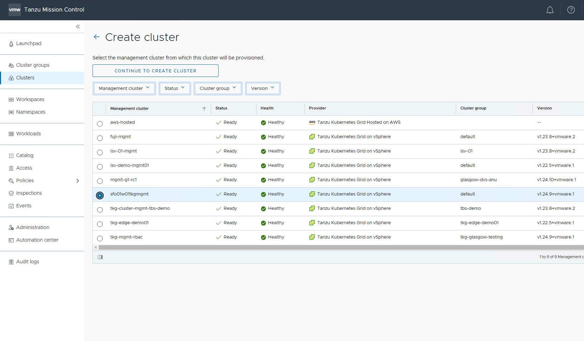

1. Select the provisioner for creating the workload cluster (shared services cluster). Provisioner reflects the vSphere namespaces that you have created and associated with the management cluster.

    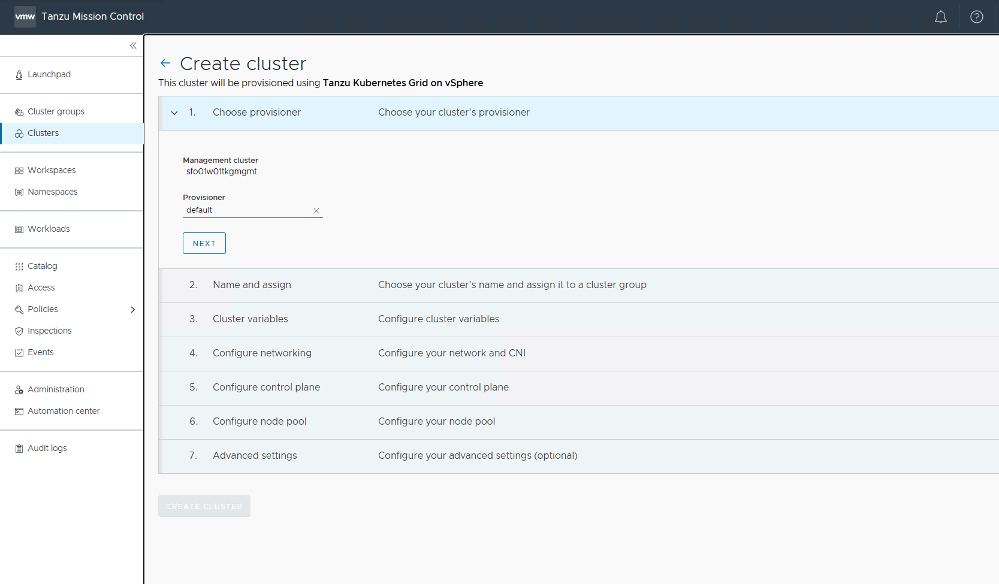

1. On the Cluster Details page, do the following: 
- Enter a name for the cluster (Cluster names must be unique within an organization).
- Select the cluster group to which you want to attach your cluster.
- Select Cluster Class from the drop down. 
- Use the NSXALB_Labels created for shared cluster on AKO Deployment.

    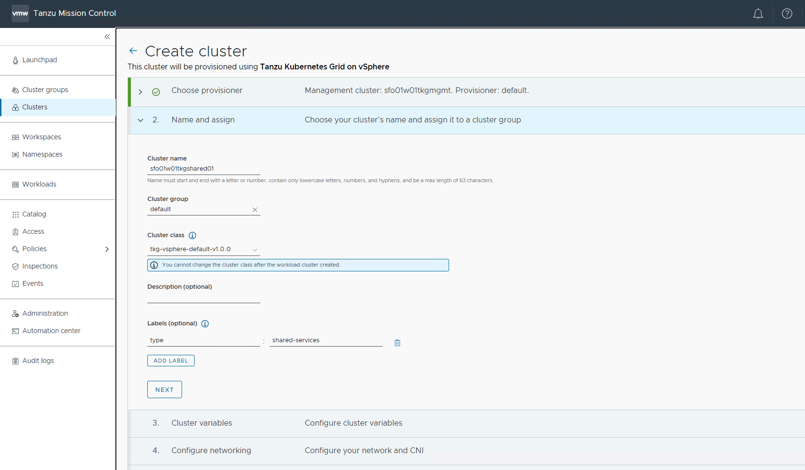

5. On the Configure page, specify the following items:

   * In the **vCenter** and **tlsThumbprint** fields, enter the details for authentication.
   * From the  **datacenter**, **resourcePool**, **folder**, **network**, and **datastore** drop down, select the required information.
   * From the **template** drop down, select the Kubernetes version.The latest supported version is preselected for you. 
   * In the **sshAuthorizedKeys** field, enter the SSH key that was created earlier.
   * Enable aviAPIServerHAProvider.

   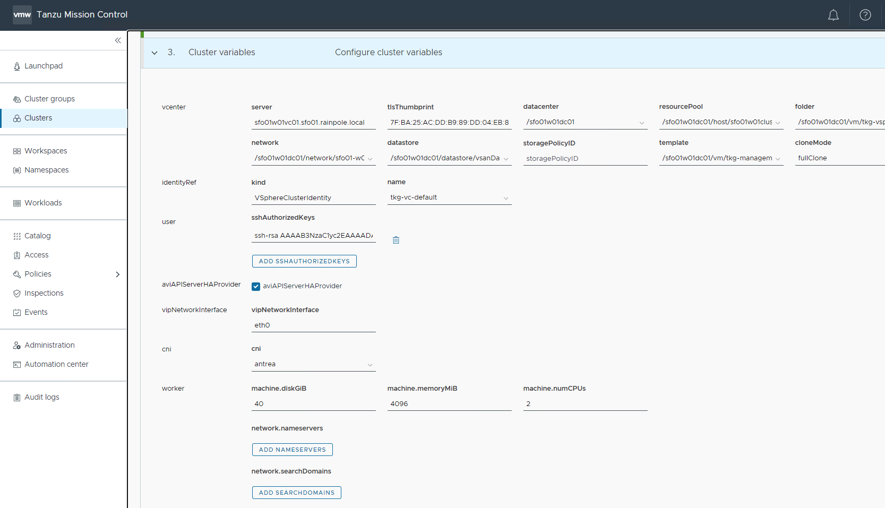

6.  Update POD CIDR and Service CIDR if necessary.

     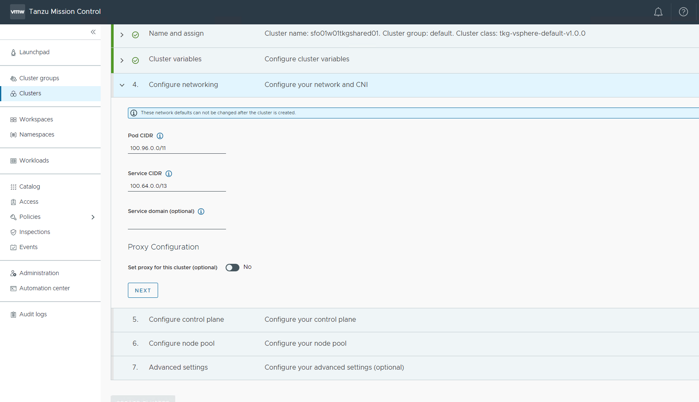

7. Select the high availability mode for the control plane nodes of the workload cluster. For a production deployment, it is recommended to deploy a highly available workload cluster.

    

1. Customize the default node pool for your workload cluster.

    * Specify the number of worker nodes to provision.
    * Select OS Version.

    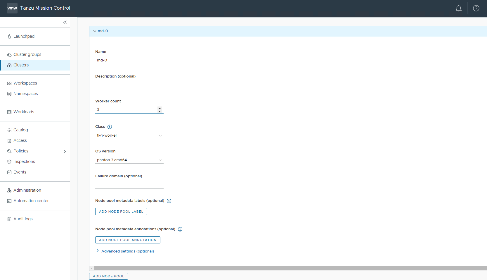

1. Click **Create Cluster** to start provisioning your workload cluster. Once the cluster is created, you can check the status from Tanzu Mission Control.<p>Cluster creation takes approximately 15-20 minutes to complete. After the cluster deployment completes, ensure that agent and extensions health shows green.

    
1. Connect to the Tanzu Management Cluster context and verify the cluster labels for the workload cluster.
    <!-- /* cSpell:disable */ -->
     ```bash
    ## verify the workload  service cluster creation

    tanzu cluster list
    NAME                  NAMESPACE  STATUS   CONTROLPLANE  WORKERS  KUBERNETES        ROLES   PLAN  TKR
    
    sfo01w0tkgshared01    default    running  3/3           3/3      v1.24.9+vmware.1  <none>  prod  v1.24.9---vmware.1-tkg.1


    ## Connect to tkg management cluster

    kubectl config use-context sfo01w01tkgmgmt01-admin@sfo01w01tkgmgmt01

    ## Add the tanzu-services label to the shared services cluster as its cluster role. In the following command "sfo01w01tkgshared01” is the name of the shared service cluster
    
    kubectl label cluster.cluster.x-k8s.io/sfo01w0tkgshared01 cluster-role.tkg.tanzu.vmware.com/tanzu-services="" --overwrite=true
    cluster.cluster.x-k8s.io/sfo01w0tkgshared01 labeled

    ## Validate that TMC has applied the AVI_LABEL while deploying the cluster

    kubectl get cluster sfo01w0tkgshared01 --show-labels
    NAME                   PHASE         AGE    VERSION   LABELS
    
    sfo01w0tkgshared01   Provisioned   105m             cluster-role.tkg.tanzu.vmware.com/tanzu-services=,networking.tkg.tanzu.vmware.com/avi=tanzu-ako-for-shared,tanzuKubernetesRelease=v1.24.9---vmware.1-tkg.1,tkg.tanzu.vmware.com/cluster-name=sfo01w0tkgshared01,type=shared-services

      ```
    <!-- /* cSpell:enable */ -->

1. Connect to admin context of the workload cluster using the following commands and validate the ako pod status.

    <!-- /* cSpell:disable */ -->
     ```bash
    ## Use the following command to get the admin context of workload Cluster.

    tanzu cluster kubeconfig get sfo01w0tkgshared01 --admin
    
    Credentials of cluster 'sfo01w0tkgshared01' have been saved
    You can now access the cluster by running 'kubectl config use-context sfo01w0tkgshared01-admin@sfo01w0tkgshared01'


    ## Use the following command to use the context of workload Cluster

    kubectl config use-context sfo01w0tkgshared01-admin@sfo01w0tkgshared01
    
    Switched to context "sfo01w0tkgshared01-admin@sfo01w0tkgshared01".
    
    # Verify that ako pod gets deployed in avi-system namespace

     kubectl get pods -n avi-system
    NAME    READY   STATUS    RESTARTS   AGE
    ako-0   1/1     Running   0          73m

    # verify the nodes and pods status by running the command:
    kubectl get nodes -o wide

    kubectl get pods -A 
     ```
    <!-- /* cSpell:enable */ -->

Now that the shared services cluster is successfully created, you may proceed with deploying the Harbor package. For more information, see [Install Harbor in Deploy User-Managed Packages in Workload Clusters](https://docs.vmware.com/en/VMware-Tanzu-Kubernetes-Grid/2.1/using-tkg-21/workload-packages-harbor.html)

### <a id="createworkload"> </a> Deploy Tanzu Kubernetes Grid Workload Cluster

As per the architecture, workload clusters make use of a custom ADC to enable NSX Advanced Load Balancer L7 ingress with NodePortLocal mode. This is enforced by providing the NSXALB_LABEL while deploying the workload cluster.

The steps for deploying a workload cluster are the same as for a shared services cluster. except use the NSX ALB Labels created for the Workload cluster on AKO Deployment in step number 4.

**After the Worload cluster creation verify the cluster labels and ako pod status**
1. Connect to the Tanzu Management Cluster context and verify the cluster labels for the workload cluster.
    <!-- /* cSpell:disable */ -->
     ```bash
    ## verify the workload  service cluster creation

    tanzu cluster list
    NAME                  NAMESPACE  STATUS   CONTROLPLANE  WORKERS  KUBERNETES        ROLES   PLAN  TKR
    
    sfo01w01shared01    default    running  3/3           3/3      v1.24.9+vmware.1  <none>  prod   v1.24.9---vmware.1-tkg.1

    sfo01w01workload01  default    running  3/3           3/3      v1.24.9+vmware.1  <none>  prod   v1.24.9---vmware.1-tkg.1

    ## Connect to tkg management cluster

    kubectl config use-context sfo01w01vc01-admin@sfo01w01vc01

    ## Validate that TMC has applied the AVI_LABEL while deploying the cluster

    kubectl get cluster sfo01w01workload01 --show-labels
    NAME                   PHASE         AGE    VERSION   LABELS
    
    sfo01w01workload01   Provisioned   105m             networking.tkg.tanzu.vmware.com/avi=tanzu-ako-for-workload-l7-ingress,tanzuKubernetesRelease=v1.249---vmware.1-tkg.1,tkg.tanzu.vmware.com/cluster-name=sfo01w01workload01,workload-l7-enabled=true


      ```
    <!-- /* cSpell:enable */ -->

1. Connect to admin context of the workload cluster using the following commands and validate the ako pod status.

    <!-- /* cSpell:disable */ -->
     ```bash
    ## Use the following command to get the admin context of workload Cluster.

    tanzu cluster kubeconfig get sfo01w01workload01 --admin
    
    Credentials of cluster 'sfo01w01workload01' have been saved
    You can now access the cluster by running 'kubectl config use-context sfo01w01workload01-admin@sfo01w01workload01'


    ## Use the following command to use the context of workload Cluster

    kubectl config use-context sfo01w01workload01-admin@sfo01w01workload01
    
    Switched to context "sfo01w01workload01-admin@sfo01w01workload01".
    
    # Verify that ako pod gets deployed in avi-system namespace

     kubectl get pods -n avi-system
    NAME    READY   STATUS    RESTARTS   AGE
    ako-0   1/1     Running   0          73m

    # verify the nodes and pods status by running the command:
    kubectl get nodes -o wide

    kubectl get pods -A 
     ```
    <!-- /* cSpell:enable */ -->

You can now configure SaaS components and deploy user-managed packages on the cluster.


## <a id="integrate-to"> </a> Integrate Tanzu Kubernetes clusters with Tanzu Observability

For instructions on enabling Tanzu Observability on your workload cluster, see [Set up Tanzu Observability to Monitor a Tanzu Kubernetes Clusters](./tko-saas-services.md#set-up-tanzu-observability-to-monitor-a-tanzu-kubernetes-clusters)

## <a id="integrate-tsm"> </a> Integrate Tanzu Kubernetes clusters with Tanzu Service Mesh

For instructions on installing Tanzu Service Mesh on your workload cluster, see [Onboard a Tanzu Kubernetes Cluster to Tanzu Service Mesh](./tko-saas-services.md#onboard-a-tanzu-kubernetes-cluster-to-tanzu-service-mesh)

## <a id="deploy-user-managed-packages"> </a> Deploy User-Managed Packages on Tanzu Kubernetes clusters

For instructions on installing user-managed packages on the Tanzu Kubernetes clusters, see [Deploy User-Managed Packages in Workload Clusters](tkg-package-install.md).
